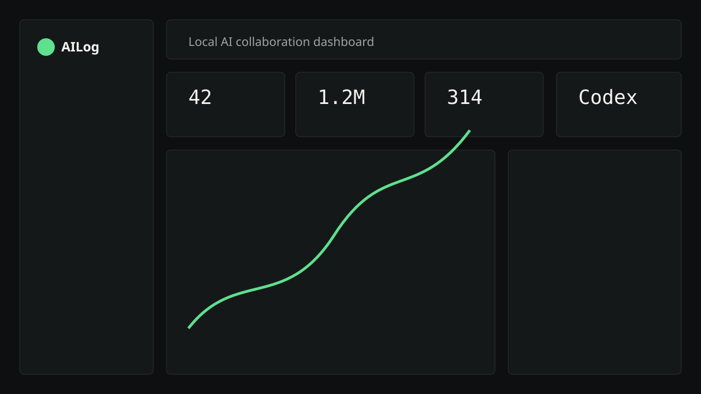
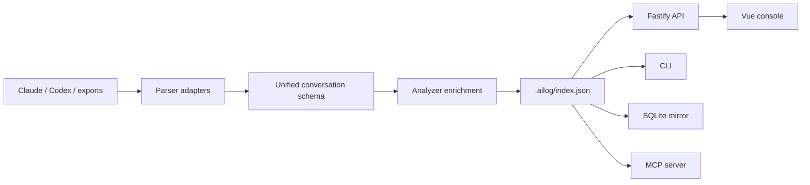

# AILog

<p align="center">
  
</p>

<p align="center">
  <strong>Your local AI collaboration logbook.</strong>
</p>

<p align="center">
  Browse Claude Code and Codex history like Git commits.<br>
  Analyze prompts like product analytics.<br>
  Keep everything local and private.
</p>

<p align="center">
  <a href="https://github.com/coder-shx/AILog/stargazers"></a>
  <a href="https://github.com/coder-shx/AILog/network/members"></a>
  <a href="LICENSE"></a>
  
  
  
  
</p>

<p align="center">
  <a href="#why-ailog">Why</a>
  ·
  <a href="#features">Features</a>
  ·
  <a href="#quick-start">Quick Start</a>
  ·
  <a href="#cli">CLI</a>
  ·
  <a href="#architecture">Architecture</a>
  ·
  <a href="#privacy">Privacy</a>
  ·
  <a href="#roadmap">Roadmap</a>
</p>

## Why AILog

AILog is local-first observability for your AI coding workflow.

Most AI coding tools produce valuable collaboration history, but that history is hard to search, compare, measure, and reuse. AILog turns local Claude Code, Codex CLI, and exported AI conversations into a developer-grade timeline, dashboard, search engine, prompt intelligence system, and exportable knowledge base.

中文简介：

AILog 是一个本地优先的 AI 协作历史管理与分析工具。它可以帮助你浏览、搜索、分析 Claude Code 和 Codex 的历史对话，像看 Git 日志一样回顾 AI 协作过程，像看数据仪表盘一样理解自己的 Prompt 习惯和 AI 行为模式。

## What It Helps You Answer

- What do I ask AI to do most often?
- Which prompts cost the most tokens?
- Which projects rely on AI the most?
- Which model works better for my workflow?
- Which task types fail or require retries?
- Which prompts are good enough to reuse?
- Which files does AI repeatedly inspect or modify?
- How did my AI coding habits change over time?

## Features

| Area | What AILog Provides |
| --- | --- |
| Timeline | Git-log style browsing for local AI collaboration history |
| Dashboard | Sessions, prompts, replies, tokens, tools, models, projects, activity heatmap |
| Prompt Intelligence | Word frequency, language ratio, intent classification, quality scoring |
| Search | Global search across prompts, replies, tool IO, files, tags, models and projects |
| Conversation Detail | Markdown rendering, tool panels, editable title/summary, message tags, favorites, copy, export |
| Compare | Token, tool, file, model, tag and prompt keyword deltas between sessions |
| Prompt Library | Persist reusable prompts and curate high-quality prompt templates |
| Privacy Center | Detect keys, tokens, emails, private keys, phone numbers and path leaks |
| Exports | Markdown, JSON, HTML, PDF, weekly/monthly/project/prompt/compare reports and full local backup |
| Integrations | CLI, local API, MCP server, Live Sessions, Tauri shell, VS Code sidebar and browser import helper |

## Screenshots

> The current repository includes a screenshot placeholder. Replace it with real product screenshots before launch.


## Quick Start

```bash
pnpm install
pnpm dev
```

Open:

- Web console: `http://127.0.0.1:1420`
- Local API: `http://127.0.0.1:1421`

If `pnpm` is not installed:

```bash
corepack enable
corepack prepare pnpm@9.15.4 --activate
```

On Windows machines where PowerShell cannot find the `pnpm` shim, use:

```bash
corepack pnpm install
corepack pnpm dev
```

## CLI

```bash
pnpm --filter @ailog/cli ailog scan
pnpm --filter @ailog/cli ailog stats
pnpm --filter @ailog/cli ailog search "fix bug"
pnpm --filter @ailog/cli ailog export --id <conversation-id> --format markdown
pnpm --filter @ailog/cli ailog report weekly
pnpm --filter @ailog/cli ailog privacy
pnpm --filter @ailog/cli ailog sqlite
pnpm --filter @ailog/cli ailog backup
pnpm --filter @ailog/cli ailog capabilities
pnpm --filter @ailog/cli ailog doctor
```

## Supported Sources

- Claude Code JSONL history under `~/.claude/`
- Codex CLI history directories configured by the user
- Generic `.json`, `.jsonl`, `.md`, `.markdown`, `.txt`, `.log`
- OpenAI, Anthropic and Gemini shaped API exports through generic adapters
- SSE stream logs through the stream adapter

Unknown formats are routed through adapter interfaces so new parsers can be added without coupling the UI to provider-specific records.

## Architecture

```txt
apps/web        Vue 3 + Vite local console
apps/server     Fastify REST API
apps/desktop    Tauri shell scaffold
packages/core   settings, local index, scan orchestration, exports
packages/parser filesystem discovery and provider adapters
packages/analyzer prompt intelligence, stats, search, redaction
packages/shared shared TypeScript schema and utilities
packages/cli    command line interface
packages/mcp    local stdio MCP JSON-RPC server
extensions/*    VS Code sidebar and browser import helper
```



AILog stores generated state locally:

- Settings: `.ailog/settings.json`
- JSON index: `.ailog/index.json`
- Optional SQLite mirror: `.ailog/index.sqlite`
- Prompt library: `.ailog/prompt-library.json`

## API Highlights

```txt
GET  /api/health
POST /api/scan
GET  /api/conversations
GET  /api/conversations/:id
GET  /api/search
GET  /api/stats/overview
GET  /api/stats/prompts
GET  /api/stats/ai-behavior
GET  /api/stats/collaboration
GET  /api/compare
GET  /api/privacy/sensitive
GET  /api/prompt-library
POST /api/export/report
POST /api/export/backup
POST /api/export/restore
POST /api/admin/clear-index
GET  /api/live-sessions
POST /api/live-sessions/:id/run
GET  /api/capabilities
```

## Privacy

AILog is designed to be private by default.

- Runs locally.
- Does not upload conversation data.
- Does not call remote LLMs for analysis by default.
- Scans source history files read-only.
- Redacts API keys, GitHub tokens, JWTs, SSH private keys, emails, phone numbers and path secrets on export.
- Keeps generated state under `.ailog/`.

## Branches

- `v1`: verified MVP rollback branch.
- `v2-final`: final feature branch with stage-two and stage-three capability surfaces.
- `main`: final delivery branch.

## Roadmap

- [x] Claude Code JSONL scanning
- [x] Codex and generic import adapters
- [x] Timeline, Dashboard, Search and Conversation Detail
- [x] Prompt Intelligence and local quality scoring
- [x] Markdown, JSON, HTML and PDF exports
- [x] SQLite mirror index
- [x] Sensitive information scanning
- [x] Prompt Library persistence
- [x] Conversation Compare
- [x] Live Session command transcript capture
- [x] MCP stdio JSON-RPC tools
- [x] VS Code sidebar and browser import helper
- [x] Optional localhost-only LLM summaries
- [x] Tauri desktop shell scaffold
- [ ] Real product screenshots and demo video
- [ ] Packaged desktop installer
- [ ] Packaged VS Code extension

## Contributing

Contributions are welcome. The main rule is simple: keep AILog local-first unless the user explicitly opts into an external integration.

1. Fork the repository.
2. Create a feature branch.
3. Add parser adapters instead of hard-coding provider formats in UI code.
4. Keep redaction enabled for new export paths.
5. Run checks before opening a pull request.

```bash
pnpm typecheck
pnpm build
```

## Development

```bash
pnpm install
pnpm dev
```

Useful package commands:

```bash
pnpm --filter @ailog/server dev
pnpm --filter @ailog/web dev
pnpm --filter @ailog/mcp start
pnpm --filter @ailog/cli ailog doctor
```

## License

MIT. See [LICENSE](LICENSE).

## Star History

If AILog helps you understand your AI coding workflow, consider starring the project.

<a href="https://star-history.com/#coder-shx/AILog&Date">
  <picture>
    <source media="(prefers-color-scheme: dark)" srcset="https://api.star-history.com/svg?repos=coder-shx/AILog&type=Date&theme=dark" />
    <source media="(prefers-color-scheme: light)" srcset="https://api.star-history.com/svg?repos=coder-shx/AILog&type=Date" />
    
  </picture>
</a>
