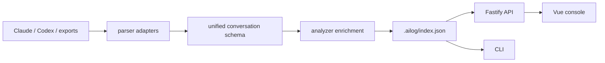

# Architecture

AILog is a pnpm workspace split into UI, API and reusable local-first packages.

## Layers

- `apps/web`: Vue 3, Pinia and Vite console. It calls only the local REST API.
- `apps/server`: Fastify API server. It owns no provider-specific parsing logic.
- `packages/core`: repository facade for settings, scanning, JSON index, tags, favorites and exports.
- `packages/parser`: recursive filesystem discovery plus parser adapters.
- `packages/analyzer`: prompt intent classification, quality scoring, stats, search, redaction and reporting helpers.
- `packages/shared`: TypeScript types, defaults and small utilities.
- `packages/cli`: local command line entrypoints.
- `packages/mcp`: local stdio MCP server that exposes AILog stats/search/recent tools.
- `apps/desktop`: Tauri shell scaffold.
- `extensions/vscode`: VS Code command scaffold.
- `extensions/browser`: Manifest V3 import-helper scaffold.

## Data Flow



## Local Index

Primary storage remains a JSON index at `.ailog/index.json` for inspectability and backup. When SQLite indexing is enabled, `packages/core/src/sqlite.ts` mirrors conversations, messages and tool calls into `.ailog/index.sqlite` using Node's local `node:sqlite` runtime.

## Runtime Surfaces

- Web UI: `http://127.0.0.1:1420`
- API: `http://127.0.0.1:1421`
- MCP stdio server: `corepack pnpm --filter @ailog/mcp start`
- CLI: `corepack pnpm --filter @ailog/cli ailog <command>`

## Extension Points

New history sources should implement `ParserAdapter`:

```ts
interface ParserAdapter {
  name: string;
  canParse(filePath: string, content: string, context?: ParseContext): boolean;
  parse(filePath: string, content: string, context?: ParseContext): AILogConversation[];
}
```

The UI and API should consume only `AILogConversation`, never provider-native records.
