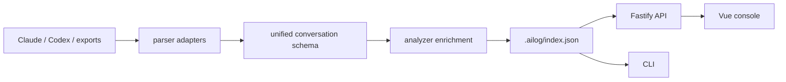

# Architecture

AILog is a pnpm workspace split into UI, API and reusable local-first packages.

## Layers

- `apps/web`: Vue 3, Pinia and Vite console. It calls only the local REST API.
- `apps/server`: Fastify API server. It owns no provider-specific parsing logic.
- `packages/core`: repository facade for settings, scanning, JSON index, tags, favorites and exports.
- `packages/parser`: recursive filesystem discovery plus parser adapters.
- `packages/analyzer`: prompt intent classification, quality scoring, stats, search, redaction and reporting helpers.
- `packages/shared`: TypeScript types, defaults and small utilities.
- `packages/cli`: local command line entrypoints.

## Data Flow



## Local Index

MVP storage is a JSON index at `.ailog/index.json`. This keeps the first version easy to inspect and backup. The schema is intentionally compatible with a later SQLite table layout.

## Extension Points

New history sources should implement `ParserAdapter`:

```ts
interface ParserAdapter {
  name: string;
  canParse(filePath: string, content: string, context?: ParseContext): boolean;
  parse(filePath: string, content: string, context?: ParseContext): AILogConversation[];
}
```

The UI and API should consume only `AILogConversation`, never provider-native records.
